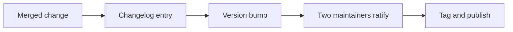

# How We Release

A release of JME is ratified by two maintainers before it is tagged.

## The steps

1. **Every merged change carries its changelog entry.** A change without one is not finished, whatever its code
   says.
2. **The version follows semantic versioning.** A change that breaks a consumer is a major version, however
   small it is.
3. **Two maintainers ratify the release.** One of them has not written any of the changes in it.
4. **The tag is the release.** The build of the tag publishes the artifacts, and nothing is published by hand.
